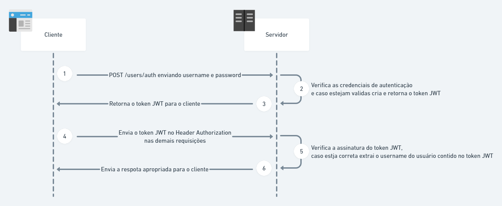

# Authorizer - Lambda Function da API Tech Challenge

[](https://github.com/fabianogoes/fiap-tech-challenge-authorizer-lambda/actions/workflows/deploy-lambda.yml)

- [Authorizer - Lambda Function da API Tech Challenge](#authorizer---lambda-function-da-api-tech-challenge)
  - [Relationship](#relationship)
  - [Setup and Build](#setup-and-build)
    - [1. Python3](#1-python3)
    - [3. Virtualenv](#3-virtualenv)
    - [Gerar o `zip` para deploy na `aws`](#gerar-o-zip-para-deploy-na-aws)
  - [Deployments](#deployments)
  - [Para criar a lambda por `awscli`](#para-criar-a-lambda-por-awscli)
  - [Para atualizar a lambda por `awscli`](#para-atualizar-a-lambda-por-awscli)
  - [Important References](#important-references)

## Relationship



- [API Tech Challenge](https://github.com/fabianogoes/fiap-tech-challenge)
- [Users - Lambda Functions da API Tech Challenge](https://github.com/fabianogoes/fiap-tech-challenge-users-lambda)
- [Authenticator - Lambda Functions da API Tech Challenge](https://github.com/fabianogoes/fiap-tech-challenge-authenticator-lambda)
- [Authorizer - Lambda Functions da API Tech Challenge](https://github.com/fabianogoes/fiap-tech-challenge-authorizer-lambda)
  
## Setup and Build 

### 1. Python3

```shell
sudo apt update && sudo apt install python3 python3-venv
```

### 3. Virtualenv

```shell
python3 -m venv .venv
source .venv/bin/activate
pip install -r requirements.txt
```

### Gerar o `zip` para deploy na `aws`

```shell
cp -r .venv/lib/python3.10/site-packages/jwt ./jwt          
cp -r .venv/lib/python3.10/site-packages/dotenv ./dotenv   
cp -r .venv/lib/python3.10/site-packages/dotenv ./boto3          
zip -r lambda_function.zip jwt/ dotenv/ boto3/ .env lambda_function.py
```

> Para desativar o virtualenv: `deactivate`

## Deployments

## Para criar a lambda por `awscli`

```shell
aws lambda create-function --function-name fiap-tech-challenge-authorizer-lambda \
  --runtime python3.8 \
  --region ${AWS_DEFAULT_REGION} \
  --role arn:aws:iam::${AWS_ACCOUNT_ID}:role/${AWS_DEFAULT_ROLE} \
  --handler lambda_function.lambda_handler --zip-file fileb://./lambda_function.zip
```

## Para atualizar a lambda por `awscli`

```shell
aws lambda update-function-code --function-name fiap-tech-challenge-authorizer-lambda --zip-file fileb://./lambda_function.zip
```

## Important References

- [AWS Lambda](https://docs.aws.amazon.com/lambda/latest/dg/welcome.html)
- [AWS CLI](https://docs.aws.amazon.com/cli/latest/userguide/cli-chap-welcome.html)
- [AWS Lambda CLI](https://docs.aws.amazon.com/lambda/latest/dg/gettingstarted-awscli.html)
- [AWS Lambda Python](https://docs.aws.amazon.com/lambda/latest/dg/python-handler.html)
- [AWS API Gateway JWT Authorizer](https://docs.aws.amazon.com/apigateway/latest/developerguide/apigateway-use-lambda-authorizer.html)
- [JWT Instruduction](https://jwt.io/introduction/)
- [GitHUb Actions configure-aws-credentials](https://github.com/aws-actions/configure-aws-credentials)