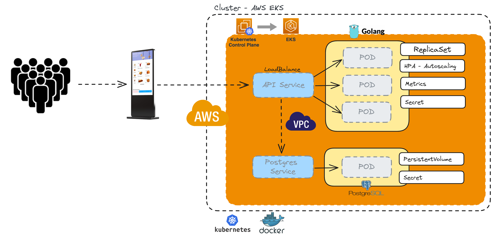

# Como testar o projeto - Tech Challenge fase 2

> Este documento descreve os passos necessários para testar o projeto 

Entregáveis:

- Video demonstrando o Deploy na AWS: [https://youtu.be/csUlJxz9n_s?si=O82ImIL7bkgZ9zQ9](https://youtu.be/csUlJxz9n_s?si=O82ImIL7bkgZ9zQ9)
- Miro com a Documentação DDD: [https://miro.com/app/board/uXjVNpDpixg=/?share_link_id=459651604667](https://miro.com/app/board/uXjVNpDpixg=/?share_link_id=459651604667)
- Repositório GitHub com o código: [https://github.com/fabianogoes/fiap-techchallenge-fase2](https://github.com/fabianogoes/fiap-techchallenge-fase2)
- [Collection Postman](https://github.com/fabianogoes/fiap-techchallenge-fase2/blob/4f240864f2b07fce43711821b8bc9c69a352231f/__utils__/FIAP-GoFood.postman_collection.json)


## Desenho da Arquitetura



---

- [Como testar o projeto - Tech Challenge fase 2](#como-testar-o-projeto---tech-challenge-fase-2)
  - [Desenho da Arquitetura](#desenho-da-arquitetura)
  - [Pré requisitos](#pré-requisitos)
  - [Passo 1 - Clonar o repositório GitHub](#passo-1---clonar-o-repositório-github)
  - [Passo 2 - Rodar a aplicação usando Docker e Docker Compose](#passo-2---rodar-a-aplicação-usando-docker-e-docker-compose)
  - [Passo 3 - Testes se a App está Heath](#passo-3---testes-se-a-app-está-heath)
  - [Passo 4 - Testar a API de Pedidos](#passo-4---testar-a-api-de-pedidos)
    - [Exemplo de alguns dados já inseridos para teste:](#exemplo-de-alguns-dados-já-inseridos-para-teste)
    - [A API de pedido segue uma sequencia lógica para iniciar um  pedido e ir até a fase de entrega.](#a-api-de-pedido-segue-uma-sequencia-lógica-para-iniciar-um--pedido-e-ir-até-a-fase-de-entrega)
    - [Teste usando o `curl`](#teste-usando-o-curl)

---

## Pré requisitos

Para rodar os testes será necessário ter instalado as seguintes ferramentas:

- [Git](https://git-scm.com/downloads)
- [Docker](https://docs.docker.com/engine/install/)
- [Docker Compose](https://docs.docker.com/compose/install/linux/)
- Cliente HTTP ([Postman](https://www.postman.com/downloads/) ou [Insomnia](https://insomnia.rest/download) ou [curl](https://curl.se/docs/manpage.html))

## Passo 1 - Clonar o repositório GitHub

```shell
git clone https://github.com/fabianogoes/fiap-techchallenge-fase2.git
```

## Passo 2 - Rodar a aplicação usando Docker e Docker Compose

```shell
cd fiap-techchallenge-fase2
docker-compose up -d
```

## Passo 3 - Testes se a App está Heath

> Esse testes pode ser feito pelo navegador mesmo através da url: `http://localhost:8080/health`

ou via terminal usando o curl

```shell
curl --request GET --url http://localhost:8080/health
```

o resultado esperado é:
```json
{"status":"UP"}
```

## Passo 4 - Testar a API de Pedidos

> Este teste pode ser feito usando Postman ou Insomnia, 
> Para isso, existe uma collection na raiz do projeto `Insomnia_collection_test.json` 
> Que pode ser importada tanto no Postman quanto no Insomnia. 
> Caso prefira testar via terminal usando `curl`, vou segue os exemplos  
  
Quando a app subir será inserido dados necessários para testar a criação de pedidos, como, Atendentes, Clientes e Produtos.

### Exemplo de alguns dados já inseridos para teste: 

| Atentente ID  | Cliente CPF | Produto ID        |
|---------------|-------------|-------------------|
| 1             | 15204180001 | 1 (Big Lanche)    |
|               |             | 6 (Coca-Cola)     |
|               |             | 22 (Batata Frita) |

 > - Para verificar a **lista de produtos** pode ser usado a API: `http://localhost:8080/products`
> - Para verificar a **lista de clientes** pode ser usado a API: `http://localhost:8080/customers`
> - Para verificar a **lista de Atendentes** pode ser usado a API: `http://localhost:8080/attendants`


### A API de pedido segue uma sequencia lógica para iniciar um  pedido e ir até a fase de entrega.  

1. Iniciando um novo Pedido
2. Adicionando Items ao Pedido
3. Removendo Item (se necessário) 
4. Confirmando Pedido
5. Enviando Pedido para Pagamento
6. Recebendo Callback do Pagamento via Webhook
7. Enviando Pedido para preparação
8. Marcando Pedido como Pronto para Entrega
9. Enviando Pedido para Entrega
10. Marcando Pedido como Entregue

### Teste usando o `curl`

> Iniciando um novo Pedido

```shell
curl --request POST --url http://localhost:8080/orders --header 'Content-Type: application/json' --data '{ "customerCPF": "15204180001", "attendantID": 1 }'
```

> Adicionando Items ao Pedido

Adicionando 1 `X-Burguer`

```shell
curl --request POST --url http://localhost:8080/orders/1/item --header 'Content-Type: application/json' --data '{ "productID": 2, "quantity": 1 }'
```

Adicionando 1 `X-Bacon`

```shell
curl --request POST --url http://localhost:8080/orders/1/item --header 'Content-Type: application/json' --data '{ "productID": 3, "quantity": 1 }'
```

Adicionando 2 `Coca-Cola`

```shell
curl --request POST --url http://localhost:8080/orders/1/item --header 'Content-Type: application/json' --data '{ "productID": 6, "quantity": 1 }'
```

Adicionando 2 `Batata Frita`

```shell
curl --request POST --url http://localhost:8080/orders/1/item --header 'Content-Type: application/json' --data '{ "productID": 22, "quantity": 1 }'
```

> Removendo Item

```shell
curl --request DELETE --url http://localhost:8080/orders/1/item/1
```

> Confirmando Pedido / Checkout

```shell
curl --request PUT --url http://localhost:8080/orders/1/confirmation
```

> Enviando Pedido para Pagamento

métodos de pagamento possíveis:

- CREDIT_CARD
- DEBIT_CARD
- MONEY
- PIX

```shell
curl --request PUT --url http://localhost:8080/orders/1/payment --header 'Content-Type: application/json' --data '{ "paymentMethod": "CREDIT_CARD" }'
```

> Recebendo callback do Pagamento via Webhook

```shell
curl --request PUT 'http://localhost:8080/orders/1/payment/webhook' --header 'Content-Type: application/json' --data '{
    "status": "SUCCESS",
    "paymentMethod": "DEBIT_CARD",
    "errorReason": ""
}'
```

> Enviando Pedido para preparação

```shell
curl --request PUT --url http://localhost:8080/orders/1/in-preparation 
```

> Marcando Pedido como Pronto para Entrega

```shell
curl --request PUT --url http://localhost:8080/orders/1/ready-for-delivery
```

> Enviando Pedido para Entrega

```shell
curl --request PUT --url http://localhost:8080/orders/1/sent-for-delivery 
```

> Marcando Pedido como Entregue

```shell
curl --request PUT --url http://localhost:8080/orders/1/delivered 
```

> Listar todos os Pedidos em andamento

```shell
curl --request 'http://localhost:8080/orders' 
```

> Consultar status do Pedido por ID

```shell
curl --request 'http://localhost:8080/orders/1'
```