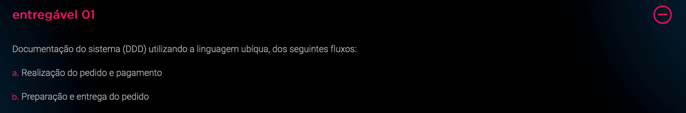
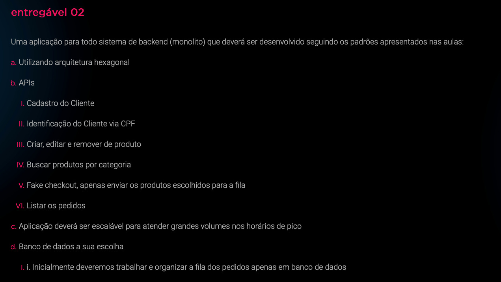

# Tech Challenge - Entregáveis fase 1

## Entregável 1

- [x] Documentação do sistema (DDD) utilizando linguagem ubíqua dos fluxos:
  - [x] Realização do pedido e pagamento
  - [x] Preparação e entrega do pedido

## Entregável 2

Uma aplicação para todo o sistema de backend (monolito) que deverá ser desenvolvido seguindo os padrões apresentados nas aulas:

- [ ] Utilizar Arquitetura Hexagona;
- [ ] APIs
  - [ ] Cadastro de Cliente
  - [ ] Identificação do Cliente via CPF
  - [ ] Criar, editar e remover produto
  - [ ] Buscar produtos por categoria
  - [ ] Fake checkout, apenas enviar os produtos escolhidos para a fila
  - [ ] Listar os pedidos
- [ ] A aplicação deverá ser escalável para atender grandes volumes nos horários de pico
- [x] Banco de dados a sua escolha
  - [ ] Inicialmente deveremos trabalhar e organizar a fila dos pedidos apenas em banco de dados

## Entregável 3

A aplicação deve ser entregue com um Dockerfile configurado para executá-la corretamente
Para validação da POC, temos a seguinte limitação de infraestrutura:

- [ ] 1 instância para banco de dados
- [x] 1 instância para executar a aplicação
